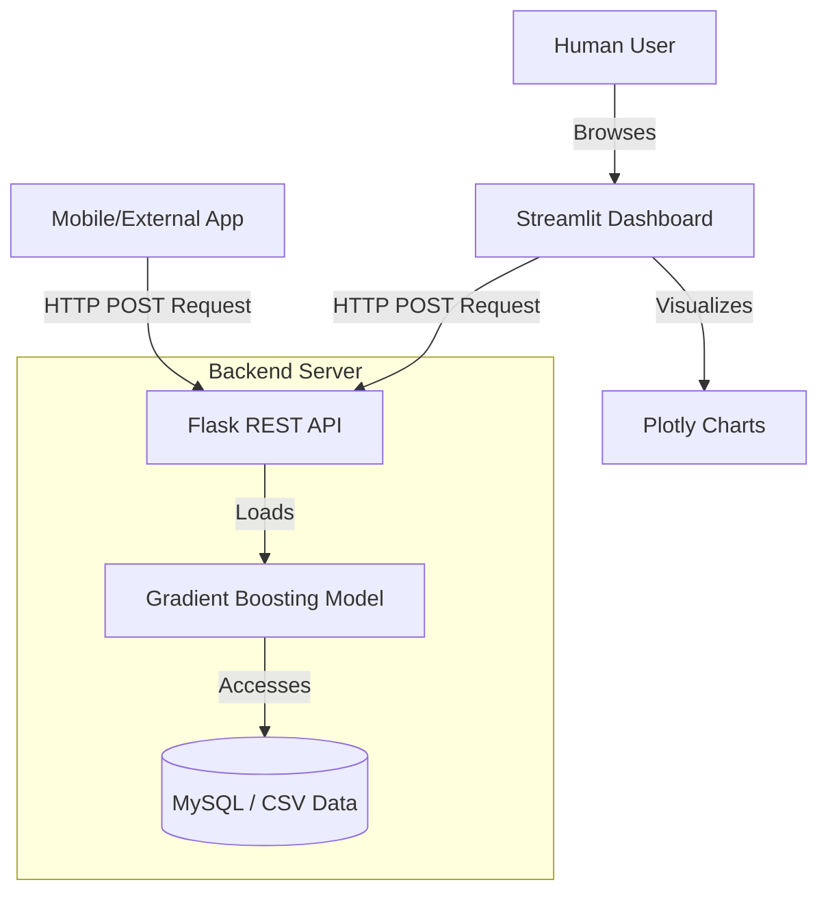

# 🌱 AgriSense Pro

A complete end-to-end Machine Learning ecosystem for predicting Indian crop yields using deep learning, ensemble models, a Flask REST API microservice, and a Streamlit interactive dashboard.


<p align="center">
  
</p>

---

## 🏗️ System Architecture

Our solution follows a professional Microservice Architecture, decoupling the heavy machine learning processing from the frontend visualization layer.



---

## 🚀 Features
1. **Interactive Dashboard**: Highly responsive Exploratory Data Analysis (EDA) explorer heavily utilizing Plotly for dynamic graphing.
2. **REST API Microservice**: Standalone backend server delivering ML predictions globally via JSON payloads.
3. **Swagger API Docs**: Beautiful auto-generated interactive documentation available out of the box via Flasgger.
4. **Ensemble Modeling**: Pipeline compares DNNs, Random Forests, XGBoost, and Gradient Boosters (the winner with R² > 0.99).

---

## 🛠️ Quick-Start Guide

To run this full application locally, you must run both the API server (Backend) and the Dashboard (Frontend) simultaneously.

### 1. Install Dependencies
Open your terminal and make sure you are in the project folder. Run:
```bash
pip install -r requirements.txt
```

### 2. Start the Flask API (Backend)
The backend must run so the frontend can retrieve predictions.
```bash
python flask_api.py
```
> [!TIP]
> **API Docs Route:** If you want to view the professional interactive Swagger documentation, leave this running and go to `http://127.0.0.1:5000/apidocs` in your browser.

### 3. Start the Streamlit Dashboard (Frontend)
Open a **second, entirely separate** terminal window, navigate to your project directory again, and run:
```bash
streamlit run streamlit_app.py
```
Streamlit will automatically open your browser to `http://localhost:8501`.

### 4. Optional: Retraining the Machine Learning Model
If you ever update the CSV dataset and need to generate new data correlations and retrain the Neural Networks, run the core pipeline script:
```bash
python crop_yield_project.py
```
*(This will automatically save 10 new EDA visualizations to the `/images/` directory and update the `outputs/model_results.json`!)*

---

## 📚 Endpoints Overview
If you explore the Swagger UI (`/apidocs`), you will find these endpoints:
- `GET /health` : Returns system operational status.
- `GET /crops` : Yields the list of supported crops dynamically from data.
- `GET /seasons` : Yields the list of supported seasons.
- `POST /predict` : Sends payload containing crop details, gets return prediction payload.
- `POST /predict/batch` : High-performance batch endpoint for thousands of rows.

*Built as a professional portfolio/startup project using modern data engineering standards.*
